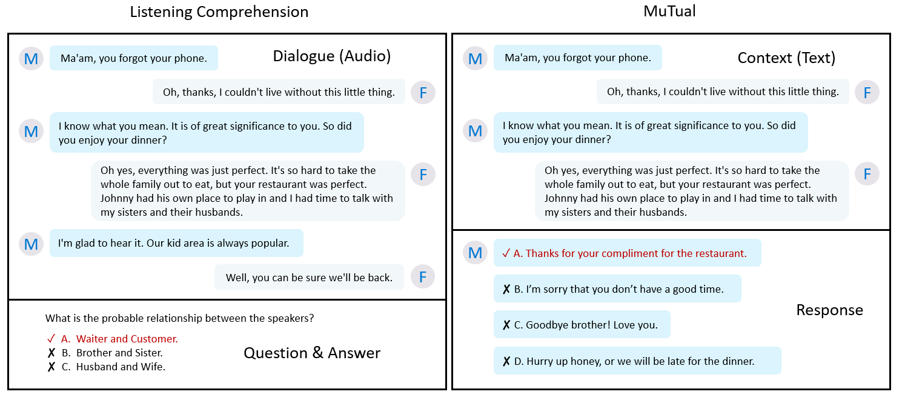

# MuTual

MuTual: A Dataset for Multi-Turn Dialogue Reasoning (ACL2020)

MuTual is retrieval-based dataset for multi-turn dialogue reasoning, which is modified from Chinese high school English listening comprehension test data. It is released with our ACL2020 paper.

This repository contains simple baseline and released dataset.

|ID|  | MuTual |
|---|--------- | --- |
|1| Context-Response Pairs | 8,860 | 
|2| #Avg. Turns per Dialogue | 4.73 |
|3| #Avg. Words per Utterance |  19.57 |
|4| Vocabulary Size (Context) |  8,809 | 
|5| Vocabulary Size (Response) |  8,943 | 
|6| Vocabulary Size |  11,343 | 
|7| # Original Dialogues |  6,371 | 
|8| # Original Questions |  11,323 | 
|9| # Response Candidates |  4 | 

- 

Coming soon.
