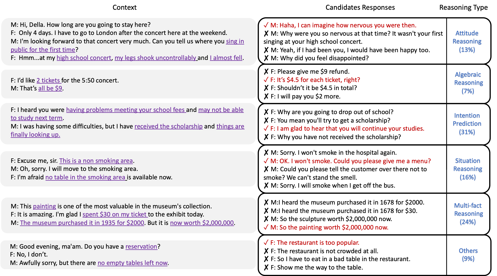

# MuTual

[MuTual: A Dataset for Multi-Turn Dialogue Reasoning](https://www.aclweb.org/anthology/2020.acl-main.130/) (ACL2020)

MuTual is a retrieval-based dataset for multi-turn dialogue reasoning, which is modified from Chinese high school English listening comprehension test data. Please see our paper for more details.

We also provide several baselines to facilitate the further research. (Coming soon)


# Example
The process of modifying the listening comprehension test data.


Examples from the MuTual dataset. All choices are relevant to the context, but only one of them is logic correct. Some negative choices might be reasonable in extreme cases, but the positive one is the most appropriate. Clue words are purple and underline.


# Data statistics

|  | MuTual |
|--------- | --- |
| Context-Response Pairs | 8,860 | 
| #Avg. Turns per Dialogue | 4.73 |
| #Avg. Words per Utterance |  19.57 |
| Vocabulary Size (Context) |  8,809 | 
| Vocabulary Size (Response) |  8,943 | 
| Vocabulary Size |  11,343 | 
| # Original Dialogues |  6,371 | 
| # Original Questions |  11,323 | 
| # Response Candidates |  4 | 

# Data template
```data/mutual/train```, ```data/mutual/dev``` and ```data/mutual/test``` are the training, development and test sets, respectively. After loading each file, you will get a dictionary. The format of them is as follows:

```
{"answers": "B", 
"options": ["m : so you come to manchester just for watching a concert , do n't you ?", "m : i really want to say that your performance in manchester must will be great !", "m : you come to manchester specially for this friend , so your friendship must be very deep .", "m : is this your first performance in manchester ? i remember you never sang at a high school concert ."], 
"article": "m : hi , della . how long are you going to stay here ? f : only 4 days . i know that 's not long enough , but i have to go to london after the concert here at the weekend . m : i 'm looking forward to that concert very much . can you tell us where you sing in public for the first time ? f : hmm ... at my high school concert , my legs shook uncontrollably and i almost fell . m : i do n't believe that . della , have you been to any clubs in manchester ? f : no , i have n't . but my boyfriend and i are going out this evening . we know manchester has got some great clubs and tomorrow will go to some bars .", 
"id": "dev_1"}
```

``` options ``` is a list of four candidates' response.

``` article ```  is the context. ```f``` and ```m``` indicate female and male, respectively. 

```answers``` is the correct answer. Noted that we do not realease the correct answer on test set.

Please send your predictions (decode output) in the [sample format](./eval_sample/decode_sample.txt)(```id + "\t" + rank1prediction + "\t" + rank2prediction + "\t" + rank3prediction + "\t" + rank4prediction``` one instance per line), methods and dev performance to cuileyang@zju.edu.cn . We will evaluate your results according to the [Eval Script](./eval_sample/eval.py).

# Reference

If the corpus or the analysis is helpful to your research, please kindly cite our paper:
```
@inproceedings{mutual,
    title = "MuTual: A Dataset for Multi-Turn Dialogue Reasoning",
    author = "Cui, Leyang  and Wu, Yu and Liu, Shujie and Zhang, Yue and Zhou, Ming" ,
    booktitle = "Proceedings of the 58th Conference of the Association for Computational Linguistics",
    year = "2020",
    publisher = "Association for Computational Linguistics",
}
```
Please feel free to contact me(cuileyang@westlake.edu.cn), if you need any further information.

# Acknowledgement
We thank [Qingkai Min](https://taolusi.github.io/qingkai_min) for helping us to build the [leaderboard](https://nealcly.github.io/MuTual-leaderboard/). 